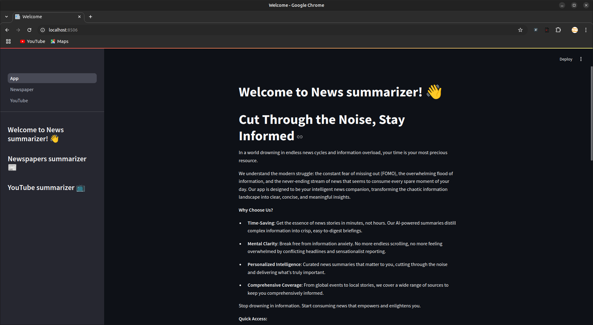
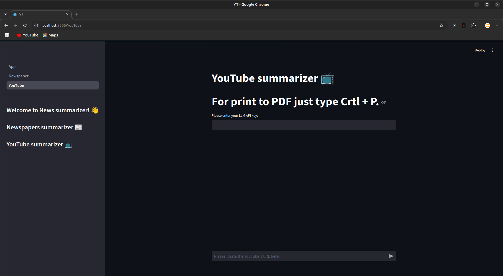
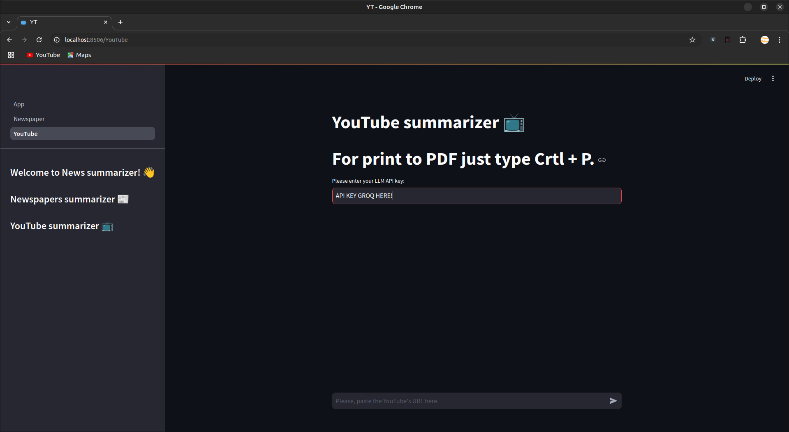
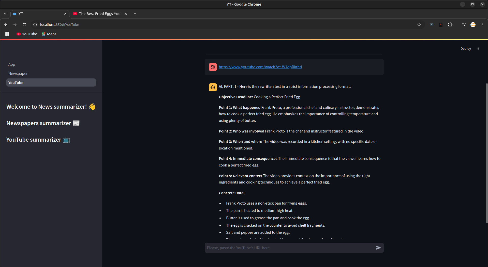

# __News summarizer__

## Author
- author: Marco Baturan
- e-mail: marco.baturan@gmail.com
- Project: https://github.com/marcobaturan/news_summarizer
- LinkedIn: https://www.linkedin.com/in/marcogarciabaturan/

## Contributors
- None
## Additional Information
This project is licensed under GPL-3.0. For more information, please refer to the LICENSE file in the root directory 
of this project.

## Abstract
News summarizer is a simple program who reads the URL 
from YouTube, extract the transcription and resume by
points the key ideas. Reduce the amount of time invest
in news.

## License
This program use a license gpl-3.0. Read the attached file gpl-3.0.txt
Read the link [how-to-gpl](https://www.gnu.org/licenses/gpl-howto.html)

## Documentation

### How to run the program

    $ virtualenv venv
    $ source venv/bin/activate
    $ pip install -r requirements.txt 
    $ streamlit run App.py

### Access to the web app

    Local URL: http://localhost:8506

## Folder structure

    .
    ├── App.py
    ├── engine.py
    ├── gpl-3.0.txt
    ├── pages
    │   ├── __init__.py
    │   ├── Newspaper.py
    │   └── YouTube.py
    ├── pictures
    │   ├── APIKEYGROQ.png
    │   ├── main_page.png
    │   ├── ytsidebar.png
    │   └── ytsummary.png
    ├── README.md
    └── requirements.txt

## Testing

    OS:       Ubuntu Mate LTS 22.04 64 bits
    HW:       HP Laptop
    RAM:      15 GiB
    CPU:      AMD Ryzen 7 4700U with Radeon Graphics × 8 
    GRAPHICS: RENOIR (Renoir, LLVM 15.0.6, DRM 3.47, 5.19.0-45-generic)
    VERSION:  Python 3.10.12

## Workflow
   
    Enter to browser:

    Click in YouTube link in left sidebar.

    Put your API KEY obtained in Groq in the top field and pulse Enter.

    Copy a YT's URL and paste in the low text input field and pulse Enter.
    URL example: https://www.youtube.com/watch?v=-W1dpRkthrI  (How to fry an egg)

## Resources

Please, if not fail the script, the environment or your operative system then you need to 
dive into the documentation's dependencies.

- [youtube-transcript-api](https://pypi.org/project/youtube-transcript-api/)
- ### Important: Get here the API KEY to the proper use. 
- [Groq](https://console.groq.com/docs/overview)
- [Streamlit](https://docs.streamlit.io)

## SOFTWARE WARRANTY DISCLAIMER
THIS SOFTWARE IS PROVIDED "AS IS" AND WITHOUT ANY EXPRESS OR IMPLIED WARRANTIES, INCLUDING, WITHOUT LIMITATION, THE IMPLIED WARRANTIES OF MERCHANTABILITY AND FITNESS FOR A PARTICULAR PURPOSE.
TO THE MAXIMUM EXTENT PERMITTED BY APPLICABLE LAW, THE AUTHOR AND COPYRIGHT HOLDERS EXPRESSLY DISCLAIM:

1. ANY AND ALL WARRANTIES, WHETHER EXPRESS, IMPLIED, STATUTORY OR OTHERWISE, INCLUDING BUT NOT LIMITED TO:

    - WARRANTIES OF MERCHANTABILITY
    - FITNESS FOR A PARTICULAR PURPOSE
    - NON-INFRINGEMENT
    - RESULTS
    - WORKMANLIKE EFFORT
    - ABSENCE OF DEFECTS
    - ACCURACY OR COMPLETENESS OF RESPONSES
    - RESULTS OR OUTPUT OBTAINED FROM THE USE OF THE SOFTWARE

2. ANY AND ALL RESPONSIBILITY FOR:

    - DIRECT, INDIRECT, INCIDENTAL, SPECIAL, EXEMPLARY, OR CONSEQUENTIAL DAMAGES
    - LOSS OF PROFITS, GOODWILL, USE, OR DATA
    - BUSINESS INTERRUPTION
    - REPLACEMENT COSTS
    - ANY OTHER COMMERCIAL DAMAGES OR LOSSES

Even if advised of the possibility of such damages and regardless of the theory of liability, whether in contract, strict liability, or tort (including negligence or otherwise) arising in any way out of the use of this software.
The user assumes all responsibility and risk for the use of this software. The software developers do not warrant that the software will be error-free or will operate without interruption.
Some jurisdictions do not allow the exclusion of implied warranties or limitations on applicable statutory rights of a consumer, so the above exclusion and limitations may not apply to you.
By using this software, you acknowledge that you have read this disclaimer, understand it, and agree to be bound by its terms.
Last updated: [2024/11/20]

